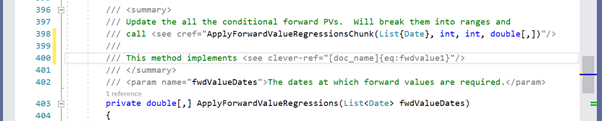

Requirements
************

In this section I keep track of ideas about what QuantDoc should do and how it should look.

General Notes
=============
The main objective of QuantDoc is to make a way to more tightly link technical code with technical
documentation.

Ideally all technical documentation, examples, introductory material and validation documentation 
should be written in the same way and be easy to keep up to date with the source code.

Idea as at 2021-03-24
=====================

Linking Source and Docs
-----------------------

In the source there is a way to put a link back to the technical document like this:

.. _fig_special_link:

Then on hover over that you get a rendered version of the section of the document that is referenced. 

This preview should be scrollable. You can also click through into the markdown/latex source for the document or to the compiled view of the document library.

In the documentation there would then also be reference links back to the source code
 

 
Other features
•	I would like the source and technical documentation to be editable in the same IDE. 
•	The IDE should allow the technical documentation to be browsed in compiled form like a wiki. 
•	The documentation should be publishable to static pages and printable pdfs for validation sign-off
•	The committed documentation should all be plain text and play nicely with source control

Running Code in Docs
Validation and model docs often have graphs that are based on some values in the code. Often this
involves saving the output to a csv or copying it to the clipboard then using 
matlab/excel/python to generate some nice graphs. Sometimes when I revisit the document later I can’t 
remember how I got the data.

I would like it if the marked down documentation could have something like what sphinx and rst 
allow:

.. code-block:: python

    .. plot::

        import matplotlib.pyplot as plt
        import numpy as np
        x = np.random.randn(1000)
        plt.hist( x, 20)
        plt.grid()
        plt.title(r'Normal: $\mu=%.2f, \sigma=%.2f$'%(x.mean(), x.std()))
        plt.show()

 
But the data for the plot could come from special static void methods in the main library. 

Potentially useful sources
--------------------------

* https://matplotlib.org/sampledoc/extensions.html
* https://matplotlib.org/basemap/users/geography.html
* https://datalab.noao.edu/docs/manual/DevGuide/restructuredtext/style.html
* https://github.com/EWSoftware/SHFB

